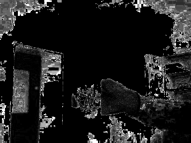
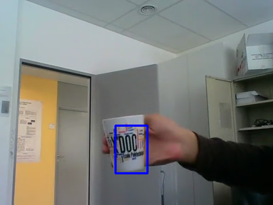

# TP3 du cours ROB313

### Auteurs du CR
Zhi Zhou, <zhi.zhou@ensta-paris.fr>
 Simon Queyrut,  <simon.queyrut@ensta-paris.fr>
 
 [@zroykhi](https://github.com/zroykhi) (repo source), [@queyrusi][github] 

[github]: http://github.com/queyrusi

Q1
------
Un des avantages du mean shift est qu'il y a peu de calculs dans l'algorithme (le [temps de calcul](https://saravananthirumuruganathan.wordpress.com/2010/04/01/introduction-to-mean-shift-algorithm/) en $O(Tn^{2})$ n'est pas important pour une poignée de pixels) donc on peut faire du tracking en temps direct et notre ordinateur n'a pas de problèmes pour le faire tourner.

Un inconvénient majeur vient du fait que la fenêtre du mean shit reste la même pendant le tracking. Donc, si l'objet est déformé (zoom avant/arrrière, rotation), le mean shift est mis en défaut. 
Se couple à cela le fait que si l'objet bouge vite, l'algorithme a moins d'informations pour prendre une décision (moins de frames par seconde).
 
Nous observons ainsi de nombreuses pertes de tracking sur les vidéos à objets qui se déforment (par exemple le basket, le ballon de football qui roule).

Q2
------
(Module `Tracking_MeanShift.py`, `# Q2`)

Nous utilisons le code ci-dessous pour afficher le contenu de hsv
```
cv2.imshow('dst', dst)
```
avant de modifier le code, l'image d'exemple est montrée ci-dessous

image of dst|original image
:----------:|:------------:
 |


Nous voyons que les pixels du bas de la porte ont des valeurs plus élevées que l'objet cible, c'est pourquoi le code a confondu la porte avec la tasse (cela associé à une vitesse élevée du mug). Pour améliorer les performances, nous utilisons le canal **S(saturation)** au lieu du canal **H(hue)** pour calculer la histogram. Le code modifié est comme ci-dessous
```
# computation mask of the histogram:
# Pixels with H<15, S<30 or V<55, S>235, V>235 are ignored 
mask = cv2.inRange(hsv_roi, np.array((15.,30.,55.)), np.array((180.,235.,235.)))
# Marginal histogram of the Hue component
roi_hist = cv2.calcHist([hsv_roi],[1],mask,[180],[0,180])
```

Nous modifions également le code suivant
```
dst = cv2.calcBackProject([hsv],[1],roi_hist,[0,180],1)
```

Le résultat a été amélioré. L'objet cible a été capturé sans aucune difficulté et il n'y a pas de perte de tracking.

image of dst|original image
:----------:|:------------:
|

Q3
-----
(Module `Tracking_MeanShift.py`, `# Question 3`)

Nous travaillons ici sur une image en intensités (niveaux de gris) $I$ grâce à la ligne 
```python
frame = cv2.cvtColor(frame, cv2.COLOR_BGR2GRAY)
```
En tout point de l'image, l'orientation $\theta = arctan(I_{y}/I_{x})$ du gradient de composantes  $I_{x}=\frac{\partial I}{\partial x}, I_{y}=\frac{\partial I}{\partial y}$ est obtenue grâce à la fonction `cv2.phase`. Ses deux arguments sont 
+ `filtered_x`, l'image filtrée par une matrice de reconnaissance des bordures (Sobel) de la direction $x$  $$x_{filter} = \begin{bmatrix}
-1 &  0& 1\\ 
 -2&  0& 2\\ 
 -1&  0& 1
\end{bmatrix}$$
+ et `filtered_y` l'image filtrée par la matrice pour la direction $y$ $$y_{filter}= \begin{bmatrix}
-1 &  -2& -1\\ 
 0&  0& 0\\ 
 1&  2& 1
\end{bmatrix}$$

Nous obtenons donc `orien`, une carte spécifiant l'orientation de chacun des pixels.

Pour la norme $\|\nabla I\|=\sqrt{I_{x}^{2}+I_{y}^{2}}$, nous définissons la map `mag = cv2.magnitude(filtered_x, filtered_y)`. 

Sur cette carte `mag` nous créons un `mask` qui donne à chaque pixel la valeur 0 si la valeur de `mag` est sous `thresh = 50` à cet endroit. Il ne reste plus qu'à mettre tous ces pixels en rouge, et le reste de différentes couleurs selon l'orientation $\theta$ renseignée dans la carte `orien` :


Q4
--------
Dans le module `hough.py` (`# Q4`), la fonction `build_r_table` va prendre une image en entrée ainsi qu'un centre ($\Omega$ choisi arbitrairement). Grâce à `cv2.Canny`, nous recueillons la carte des bordures sur laquelle nous allons itérer. Pour chacun des pixels $M(i,j)$ de cette carte, nous rangeons, s'il y a lieu (un pixel nul dans la carte sera mis à l'écart), dans un dictionnaire à la page `gradient[i,j]`, le vecteur $\vec{M\Omega}$ comme dans le cours.

 + **Remarque** : il aurait été logique d'utiliser, au lieu de `cv2.Canny`, la question précédente et profiter du `thresh`, la valeur seuil qui indiquait quels pixels étaient pertinents. Nous choisissons de continuer avec la fonction de la librairie pour éviter de propager une éventuelle erreur de notre part pour la suite du TP.

La R-Table ainsi construite, elle est donnée en entrée à la fonction `accumulate_gradients` qui prend également une image en niveaux de gris. Cette fonction retourne un `accumulator`, ou encore $H$, une carte des votes mise à jour, avec les notations usuelles du cours, par $$
H\left(x+\delta_{\lambda(x)}^{j}\right)+=\omega_{\lambda(x)}^{j}$$ où $\omega_{\lambda(x)}^{j}$ vaut $1$ dans le cadre du TP. Une petite fonction `n_max` nous renvoit la position du pixel avec le plus de votes, ainsi que le nombre de votes (bien qu'il ne soit pas utile ici). 

Avec `cv2.rectangle` nous affichons le nouveau rectangle centré sur ce pixel, avec les même dimensions que celles données initialement par le traçage à la souris de l'utilisateur.

+ Les performances sont bonnes puisque le rectangle suit le mug. Cependant, l'algorithme n'est toujours pas robuste contre les variations de zoom : l'objet qui avance ou recule dans l'axe optique n'est plus le même aux yeux de la R-Table initiale, le vote est donc faussé, mais pour des vitesses faibles l'objet reste au moins toujours dans le cadre rectangulaire.

+ Plus inquiétant, le temps de calcul entre l'affichage de deux images est d'environ 4,3 secondes. Cela garantit de ne pas pouvoir utiliser l'algorithme en l'état pour de vraies missions de tracking : les objets que l'on suit courament évoluant à des vitesses (ramenées à la dimension de l'objet) plus élevées (par exemple les voitures), on risque de perdre l'objet au bout d'un moment (une caméra de suivi n'aura pas le temps de s'appercevoir qu'un objet sort de son champ de vision et qu'elle a besoin de modifier son attitude). 

Q5
--------
(Toujours dans le module `hough.py`, chercher `# Q5`)

Au lieu de centrer la fenêtre sur $\underset{x}{\arg \max }\ H(x)$, nous utilisons `cv2.meanshift` qui va décaler la fenêtre en se basant sur la densité locale de vote dans l'accumulateur $H(x)$. 

Nous obtenons des résultats équivalents à ceux de la question précédente sans effets améliorants notables si ce n'est la vitesse de calcul. 
La technique de séléction de la meilleure fenêtre, étant donné une carte des votes, relève de l'heuristique de recherche.

+ La stratégie à adopter pour les déformations de l'objet serait CAMshift (Continuously Adaptive Meanshift). On applique d'abord meanshift. Une fois que meanshift converge, il met à jour la taille de la fenêtre. Il calcule également l'orientation de l'ellipse la mieux adaptée. Encore une fois, il applique le meanshift avec une nouvelle fenêtre de recherche à l'échelle et l'emplacement de la fenêtre précédente. Le processus se poursuit jusqu'à ce que la précision requise soit atteinte.
