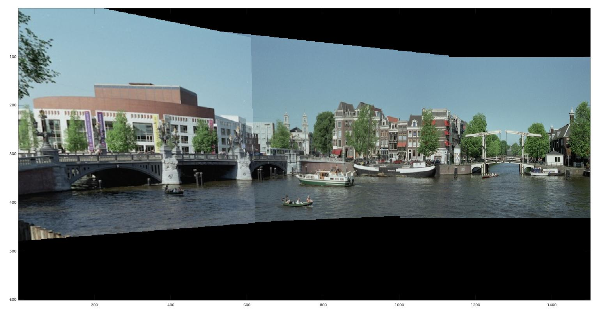

TP1 - Estimation d'homographies et reconstruction de panoramas
====

### Auteurs du CR
Zhi Zhou, <zhi.zhou@ensta-paris.fr>
 Simon Queyrut,  <simon.queyrut@ensta-paris.fr>
 
 [@zroykhi](https://github.com/zroykhi), [@queyrusi][github] 

[github]: http://github.com/queyrusi

Question 1
------
Nous choisissons comme points d'origine les coins de la mosaïque 

ce qui donne pour la matrice 4x3 :

`PtO = [142.44, 44.894, 1; 356.15, 45.761, 1; 111.86, 253.53, 1;370.59, 260.03, 1]'`

et pour les points de destinations nous choisissons 

`PtD = [120, 20, 1; 320, 20, 1; 120, 320, 1; 320, 320, 1]'`

+ La matrice `A` est celle du problème d'estimation par DLT vu en cours (`w` scale vaut 1)
+ La décomposition SVD est assurée par `[U, S, V] = svd(A, 0)`
+ Nous extrayons la dernière colonne de `V`

Nous appelons `homography2d`  et affichons l'image résultante :

Question 2
------
Nous augmentons le nombre de points utilisés pour calculer la matrice de transformation. Nous pouvons voir que plus nous utilisons de points, plus l'image est précise après la fusion. Selon **RANSAC**, plus nous utilisons d'échantillons, moins il y a de chance que tous les échantillons soient mauvais, donc le résultat sera plus précis.

4 points  |  8 points | 13 points
:-------------------------:|:-------------------------:|:-------------------------:
  |  | 

Enfin, nous utilisons 10 autres points pour fusionner les 3 images ensemble, et le résultat est illustré ci-dessous. 

Fusion de 3 images |
:--------------------------:

On voit que la qualité de l'image est assez bonne.