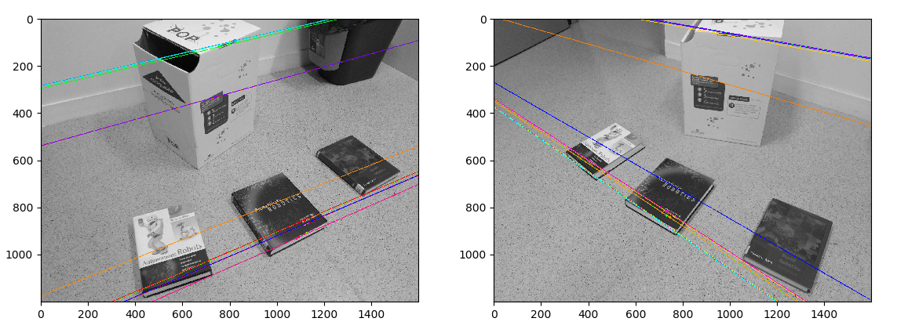

# TP2 du cours ROB313

### Auteurs du CR
Zhi Zhou, <zhi.zhou@ensta-paris.fr>
 Simon Queyrut,  <simon.queyrut@ensta-paris.fr>
 
 [@zroykhi](https://github.com/zroykhi) (repo source), [@queyrusi][github] 

[github]: http://github.com/queyrusi
Q1
------
Avec les paramètres KAZE par défaut ainsi que ceux du filtre de Lowe avec **ratio test** et **treshold**, nous avons les nombres de points 

|Image | Nb Points clé  |    
:---:|:-------------------------:|
1 | 2160
2 | 1638

et 132 inliers sur 1925 match (après filtrage).


Le résultat est mauvais : les lignes d'une image ne convergent pas vers la caméra qui a capturé l'autre.

Cette image est relativement simple, la méthode KAZE n'est pas mise en échec avec ses paramètres initiaux puisque les points clés sont bien choisis (formes spéciales et coins sur les objets d'intérêt ; il n'est pas nécessaire ici de régler les octaves qui dictent le nombre de répliques basse résolution de l'image originale ou les niveaux de flou d'`nOctaveLayers`)


mais le nombre de match initial (2160) reste très élevé après filtrage. La section 7.1 du [papier de Lowe](https://www.cs.ubc.ca/~lowe/papers/ijcv04.pdf) montre qu'il peut y avoir un ratio de distance $\frac{closest1}{closest2}$ à partir duquel la probabilité de faire un mauvais choix est très élevée dans le choix d'un match. Nous baissons ce ratio à 0.7 pour un bon résultat, avec `(m.distance < 0.7 * n.distance)`.

Il n'y a plus que 92 points d'appariement maintenant (72 survivent au RANSAC), et l'estimation de la matrice fondamentale semble plus satisfaisante :


Q2
------
Le taux d’outliers est `23% (7/30)`, nous avons donc choisi 33 comme nombre d'itérations selon le tableau RANSAC. Chaque itération, nous avons choisi au hasard 7 points parmi les **matched points**, et calculé la matrice F correspondante,
```
index = random.sample(range(pts1.shape[0]), 7)
pts1_tmp = pts1[index]
pts2_tmp = pts2[index]
FRansac, mask = cv2.findFundamentalMat(pts1_tmp, pts2_tmp, cv2.FM_7POINT, 1)
# select one of the three solutions
FRansac = FRansac[:3]
```
La fonction calculant la matrice fondamentale ne renvoie normalement qu'une seule solution. Mais dans le cas de l'algorithme `cv2.FM_7POINT`, la fonction peut renvoyer jusqu'à 3 solutions (9*3 matrices qui stockent les 3 matrices séquentiellement). Nous avons choisi la première solution parmi les 3 solutions. Puis, nous avons calculé les lignes épipolaires dans l’image 2 à partir des points de l'image 1 et de la matrice F
```
lines2 = cv2.computeCorrespondEpilines(pts1_tmp.reshape(-1,1,2), 1, FRansac)
lines2 = lines2.reshape(-1,3)  
```

Nous avons compté et enregistré le nombre de points dans l'image 2 qui sont à une distance de leur ligne épipolaire inférieure à 3 pixels(inliers) et mémorisé F si le nombre d’inliers est supérieur au meilleur nombre trouvé jusqu'ici. 
```
# select inlier points
inliersPt1_tmp = []
inliersPt2_tmp = []
index_taken = []
for l in lines2:
    for i in range(len(pts2)):
        if (calcDist(l[0], l[1], l[2], pts2[i][0], pts2[i][1]) < ransac_thredhold) and \
        i not in index_taken:
            inliersPt1_tmp.append(pts1[i])
            inliersPt2_tmp.append(pts2[i])
            index_taken.append(i)
if len(inliersPt1_tmp) > len(inliersPt1):
    bestF = FRansac
    inliersPt1 = inliersPt1_tmp
    inliersPt2 = inliersPt2_tmp
```
Le résultat que nous avons obtenu est montré comme image ci-dessous:



Nous pouvons voir que le résultat est assez proche de la question précédente.
